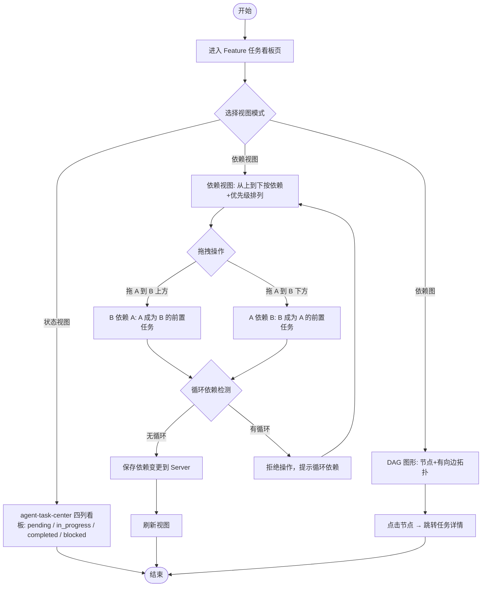
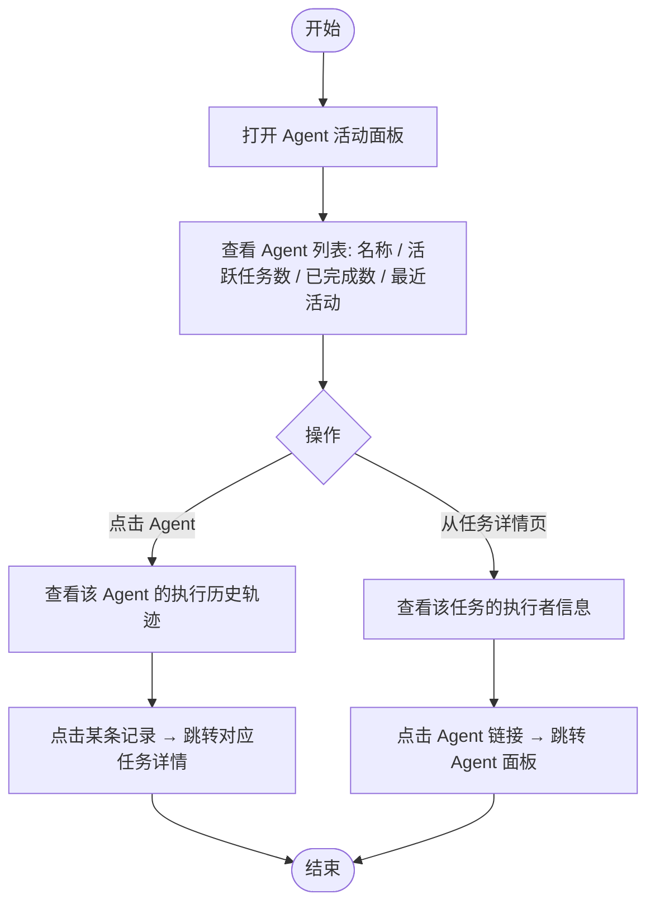

# Agent Task Center V2 — PRD Spec

> PRD Spec: defines WHAT the feature is and why it exists.

## 需求背景

### 为什么做（原因）

agent-task-center 已实现核心功能：四层数据模型、只读看板、文件上传、CLI 推送、Agent 远程操作。但在实际使用中暴露三个核心局限：

1. **依赖不可视** — 任务间的依赖关系仅存储在 index.json 中，无法直观查看哪些任务阻塞了其他任务，开发者需要手动翻阅 JSON 才能理解执行顺序
2. **依赖难维护** — 当任务依赖关系需要调整时，只能通过修改 index.json 再重新 push，缺少直观的交互方式来调整依赖
3. **Agent 活动不可追踪** — 多个 Agent 并行工作时，无法从全局视角了解各 Agent 的活跃状态和工作负载，也无法快速查看某个 Agent 的执行历史

### 要做什么（对象）

为 Agent Task Center 新增三个增强功能：

- **任务依赖图**：Feature 级别的 DAG 可视化，图形化展示任务间依赖拓扑，节点颜色反映状态
- **看板依赖视图 + 拖拽**：在现有状态看板基础上新增依赖视图模式，从上到下按依赖关系排列任务，支持拖拽操作改变依赖关系
- **Agent 活动面板**：全局 Agent 面板展示所有 Agent 的活跃状态和工作负载，任务级增强展示执行者详情

### 用户是谁（人员）

| 角色 | 说明 |
|------|------|
| 开发者 | 通过 Web UI 查看任务依赖关系、调整依赖、监控 Agent 活动状态 |
| AI Agent | 被开发者通过 Agent 面板观察和审计的对象（被动角色） |

## 需求目标

| 目标 | 量化指标 | 说明 |
|------|----------|------|
| 依赖关系可视化 | Feature 内所有 Task 依赖关系 100% 可视 | 消除翻阅 JSON 的需求，图形直观展示拓扑 |
| 依赖关系可交互 | 拖拽操作 ≤ 2 步完成一次依赖变更 | 降低依赖调整的操作成本 |
| Agent 活动透明 | 面板加载 ≤ 1s，覆盖 100% 有活动记录的 Agent | 一页了解团队执行情况 |
| 向后兼容 | agent-task-center 所有功能和交互不受影响 | 双模式看板为增量，不破坏现有体验 |

## Scope

### In Scope
- [ ] 任务依赖图 DAG 可视化（Feature 级别，图形拓扑渲染）
- [ ] 看板依赖视图模式（从上到下按依赖+优先级排列）
- [ ] 看板拖拽改变依赖关系（拖到上方=前置，拖到下方=后继）
- [ ] 全局 Agent 活动面板（Agent 列表、活跃任务数、已完成数、最近活动）
- [ ] Agent 执行历史轨迹（点击 Agent 查看历史执行记录）
- [ ] 任务级 Agent 信息增强（执行者详情展示）

### Out of Scope
- 认证 / 授权
- Web UI 表单创建 / 编辑实体
- AI 自动规划 / 任务拆解
- Feature 文件同步
- 实时通知（WebSocket）
- CI/CD 集成
- MCP Server 模式
- 任务自动调度算法
- 拖拽改变任务状态（V2 拖拽仅改变依赖关系）
- 跨 Feature 的依赖关系
- DAG 节点搜索/过滤功能（按状态、优先级、task_id 筛选）

## 流程说明

### 业务流程说明

V2 在 agent-task-center 基础上新增两条业务主线：

1. **依赖管理流程**：开发者在看板页切换到依赖视图或 DAG 图，查看和调整任务间的依赖关系
2. **Agent 监控流程**：开发者通过 Agent 面板了解全局 Agent 活动状态，或从任务详情页查看执行者信息

### 业务流程图

**依赖关系查看与调整流程：**

**Agent 活动监控流程：**

### 数据流说明

| 数据流编号 | 源系统 | 目标系统 | 数据内容 | 传输方式 | 频率 | 格式 | 备注 |
|-----------|--------|----------|----------|----------|------|------|------|
| DF-V201 | Web UI | Server | 依赖关系变更（taskId, dependsOn） | REST API | 拖拽操作 | JSON | 新增依赖变更 API |
| DF-V202 | Server | Web UI | Task 依赖关系数据 | REST API | 页面请求 | JSON | 依赖视图+DAG 图 |
| DF-V203 | Server | Web UI | Agent 活动数据 | REST API | 页面请求 | JSON | Agent 面板 |
| DF-V204 | Server | Web UI | Agent 执行历史 | REST API | 页面请求 | JSON | Agent 详情 |

## 功能描述

### 5.1 任务依赖图（DAG 可视化）

**数据来源**：选定 Feature 下所有 Task 及其依赖关系

**显示范围**：当前 Feature 的全部 Task

**页面类型**：图形页

**布局说明**：

节点代表 Task，有向边代表依赖关系（A → B 表示 B 依赖 A）。

**节点颜色**：

| 状态值 | 显示颜色 | 业务含义 |
|--------|----------|----------|
| pending | 灰色 | 任务等待认领 |
| in_progress | 蓝色 | Agent 已认领正在执行 |
| completed | 绿色 | Agent 已提交执行记录 |
| blocked | 红色 | 任务无法继续执行 |

**节点字段**：

| 字段名称 | 类型 | 说明 |
|---------|------|------|
| task_id | string | 任务编号，显示在节点上 |
| 标题 | string | 任务标题，显示在节点上 |
| 状态颜色 | string | 按状态映射颜色 |
| 优先级 | string | P0/P1/P2，边框粗细或标签标注 |

**交互**：

| 操作 | 说明 |
|------|------|
| 点击节点 | 跳转对应任务详情页 |
| 缩放 | 浏览大型依赖图 |
| 平移 | 浏览大型依赖图 |
| 悬停节点 | Tooltip 显示任务摘要信息（task_id、标题、状态、认领者） |

**States**：

| State | Display | Trigger |
|-------|---------|---------|
| Loading | 加载动画 | 进入页面 |
| Populated | DAG 图形渲染 | 数据加载完成 |
| Empty | 空状态提示 | 该 Feature 无任务 |
| No Dependencies | 节点无连线 | 所有任务独立无依赖 |

### 5.2 看板依赖视图 + 拖拽

**页面类型**：列表页（看板新模式，与状态视图可切换）

**布局说明**：

单列垂直布局，从上到下按依赖关系和优先级排列任务。前置任务排列在上方，后继任务排列在下方。同层级无依赖关系的任务按优先级排序（P0 优先）。

**示例数据**：

| 位置 | task_id | 标题 | 优先级 | 状态 |
|------|---------|------|--------|------|
| 1 | 1.1 | 初始化项目结构 | P0 | completed |
| 2 | 1.2 | 设计数据模型 | P0 | completed |
| 3 | 2.1 | 实现 API 路由 | P0 | in_progress |
| 4 | 2.2 | 实现文件解析 | P1 | pending |
| 5 | 3.1 | 实现看板页面 | P1 | pending |

**拖拽交互**：

| 拖拽操作 | 结果 | 说明 |
|----------|------|------|
| 拖 Task A 到 Task B 上方 | B 依赖 A | A 成为 B 的前置任务 |
| 拖 Task A 到 Task B 下方 | A 依赖 B | B 成为 A 的前置任务 |
| 拖拽过程中 | 显示插入位置指示线 | 蓝色虚线标记预期位置 |

**校验规则**：

| 序号 | 校验条件 | 错误提示 | 提示方式及位置 |
|------|----------|----------|----------------|
| 1 | 拖拽会产生循环依赖 | "无法建立依赖：会形成循环依赖" | Toast 通知 |
| 2 | 依赖自身 | 忽略操作，恢复原位 | 无提示 |

**States**：

| State | Display | Trigger |
|-------|---------|---------|
| Loading | 骨架屏 | 切换到依赖视图 |
| Populated | 垂直任务列表 | 数据加载完成 |
| Dragging | 插入位置指示线 | 拖拽任务卡片 |
| Saving | 操作确认动画 | 保存依赖变更 |

### 5.3 全局 Agent 活动面板

**数据来源**：Server 中所有 Agent 的执行记录聚合

**显示范围**：所有有过活动的 Agent

**排序方式**：默认按最近活动时间倒序

**翻页设置**：每页 20 条，支持翻页

**页面类型**：列表页

**列表字段**：

| 字段名称 | 类型 | 说明 |
|---------|------|------|
| Agent ID | string | Agent 唯一标识，可点击跳转详情 |
| 活跃任务数 | number | 当前 in_progress 状态的任务数 |
| 已完成任务数 | number | 历史已完成任务总数 |
| 最近活动时间 | datetime | 最后一次 claim/record 操作时间 |
| 当前认领任务 | string | 正在执行的任务 task_id 和标题 |

**示例数据**：

| Agent ID | 活跃任务数 | 已完成数 | 最近活动 | 当前任务 |
|----------|-----------|---------|----------|----------|
| claude-opus-001 | 1 | 8 | 2026-04-12 14:30 | 2.1 实现 API 路由 |
| claude-sonnet-002 | 2 | 5 | 2026-04-12 14:15 | 3.1 看板页面 + 3.2 筛选功能 |
| gpt-4-003 | 0 | 12 | 2026-04-11 18:00 | — |

**搜索条件**：

| 序号 | 搜索项 | 控件类型 | 说明 | 默认提示 |
|------|--------|----------|------|----------|
| 1 | Agent ID | 输入框 | 模糊匹配 | 搜索 Agent ID |

### 5.4 Agent 执行历史轨迹

**页面类型**：详情页

**数据来源**：选定 Agent 的所有执行记录

**显示范围**：该 Agent 参与过的所有任务的执行记录

**排序方式**：按时间倒序

**翻页设置**：每页 20 条，支持翻页

**列表字段**：

| 字段名称 | 类型 | 说明 |
|---------|------|------|
| 时间戳 | datetime | 执行时间 |
| 任务 task_id | string | 可点击，跳转任务详情 |
| 任务标题 | string | 任务标题 |
| 操作类型 | string | claim / record / status |
| 摘要 | string | 执行记录 summary |

**搜索条件**：

| 序号 | 搜索项 | 控件类型 | 说明 | 默认提示 |
|------|--------|----------|------|----------|
| 1 | 时间范围 | 日期范围选择器 | 筛选指定时间段的执行记录 | 选择时间范围 |
| 2 | 操作类型 | 下拉选择 | claim / record / status 三种类型过滤 | 全部类型 |

### 5.5 任务级 Agent 信息增强

**关联改动说明**：

| 序号 | 涉及项目 | 功能模块 | 关联改动点 | 更改后逻辑说明 |
|------|----------|----------|------------|----------------|
| 1 | agent-task-center | 任务详情页 | 认领者字段 | 从纯文本升级为可点击链接，新增认领时间和 Agent 总完成数 |
| 2 | agent-task-center | 任务详情页 | 执行记录区域 | 每条记录的 agent_id 字段升级为可点击链接 |

**增强字段**：

| 字段名称 | 类型 | 说明 |
|---------|------|------|
| 认领者 Agent ID | string | 可点击链接，跳转 Agent 面板 |
| 认领时间 | datetime | Agent 认领任务的时间 |
| Agent 总完成数 | number | 该 Agent 历史完成的总任务数 |

## 其他说明

### 性能需求
- DAG 图形渲染：≤ 50 个节点时首次渲染 ≤ 1s
- 拖拽操作响应：≤ 200ms 视觉反馈，API 保存 ≤ 500ms
- Agent 面板加载：≤ 1s
- 循环依赖检测：拖拽放置时实时检测，≤ 100ms
- 兼容性：现代浏览器（Chrome、Firefox、Safari、Edge 最新两个主版本）

### 数据需求
- 数据埋点：V2 不要求
- 数据初始化：依赖关系数据来源于 agent-task-center Task 实体的 dependencies 字段，无需额外初始化
- 数据迁移：V2 无数据迁移需求，Agent 活动数据从现有执行记录聚合计算

### 监控需求
- 延续 agent-task-center 策略，Server 日志记录 API 请求即可

### 安全性需求
- 传输加密：延续 agent-task-center，支持 HTTPS
- 依赖关系变更 API：无权限控制（延续 agent-task-center 信任模式）
- 仅允许通过 Web UI 拖拽改变依赖关系，不开放独立的依赖变更 CLI 命令

---

## 质量检查

- [x] 需求标题是否概括准确
- [x] 需求背景是否包含原因、对象、人员三要素
- [x] 需求目标是否量化
- [x] 流程说明是否完整
- [x] 业务流程图是否包含（Mermaid 格式）
- [x] 列表页描述是否完整（数据来源/显示范围/权限/排序/翻页/字段/搜索）
- [x] 按钮描述是否完整（权限/状态/校验/数据逻辑）
- [x] 表单描述是否完整（字段/校验规则）
- [x] 关联性需求是否全面分析
- [x] 非功能性需求（性能/数据/监控/安全）是否考虑
- [x] 所有表格是否填写完整
- [x] 是否有歧义或模糊表述
- [x] 是否可执行、可验收
