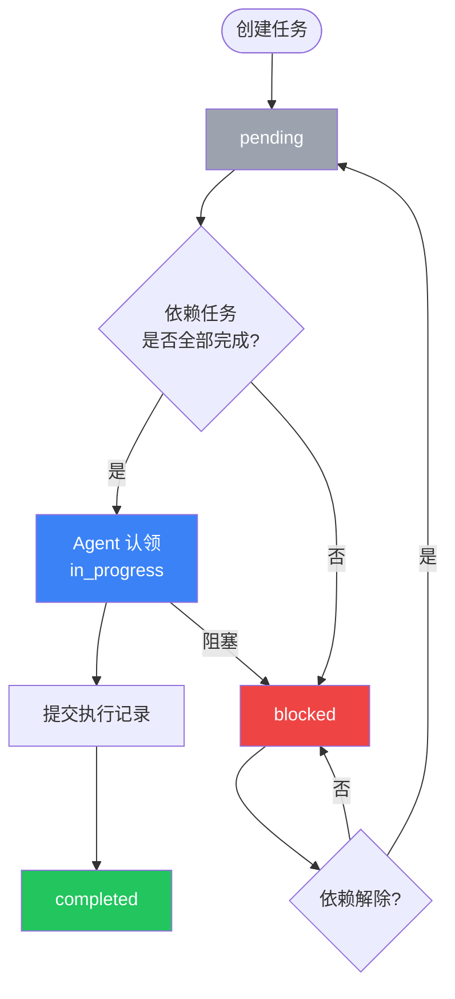
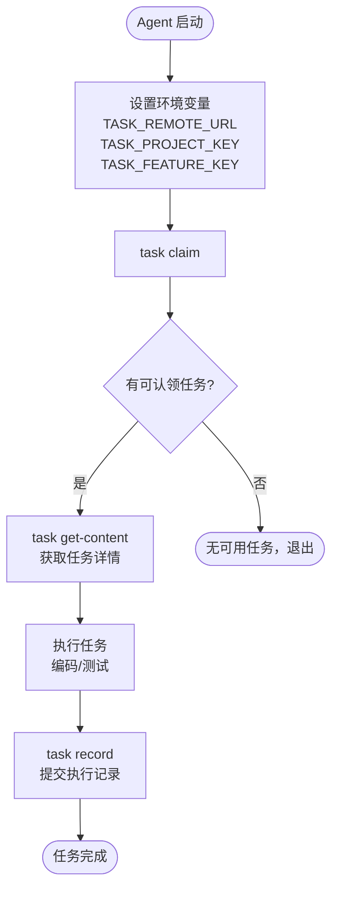

# Agent Task Center

## 需求背景

### 为什么做（原因）

当前 zcode 的 task-cli 是纯本地文件系统工具，任务数据（index.json）存在于单个项目目录中，带来以下限制：

1. **无法集中管理** — 无法在一个地方查看多个项目的任务状态
2. **无可视化** — 缺少任务依赖图和执行进度的可视化
3. **无共享** — 多 agent 各自操作本地文件，无法共享任务状态
4. **无追踪** — 缺少执行历史和 agent 活动追踪

### 要做什么（对象）

构建 Agent Task Center —— 一个集中化的任务管理服务，包含：
- Go 后端 REST API 服务
- Vue3 Web UI（任务看板、依赖图、执行记录）
- task-cli 远程模式扩展

### 用户是谁（人员）

| 用户 | 交互方式 | 核心需求 |
|------|---------|---------|
| 开发者/管理者 | Web UI | 查看多项目任务看板、监控执行进度 |
| AI Agent（Claude Code、Codex 等） | task-cli 远程模式 | 领取/管理任务，与现有工作流无缝衔接 |

## 需求目标

| 目标 | 量化指标 | 说明 |
|------|----------|------|
| 集中化任务管理 | 支持管理 ≥3 个项目的任务 | 统一任务中心，消除项目间切换 |
| Agent 零学习成本接入 | task-cli 所有现有命令在远程模式下正常工作 | 通过环境变量切换，无需修改 agent 工作流 |
| 可视化看板 | Web UI 实时反映任务状态变更 | 拖拽看板 + 依赖图 + 执行记录 |
| 并发安全 | ≥3 个 agent 同时领取不同任务不冲突 | 乐观锁保证认领原子性 |

## Scope

### In Scope

- [ ] Go 后端 REST API 服务（双路由：`/api/agent/` 面向 AI，`/api/` 面向 Web UI）
- [ ] Vue3 Web UI（任务看板、任务依赖图、执行记录时间线）
- [ ] task-cli 远程模式扩展（环境变量切换本地/远程模式）
- [ ] 多项目管理（Project → Feature → Task 三层结构）
- [ ] SQLite（本地开发）+ PostgreSQL（生产）双存储适配
- [ ] index.json 导入接口（批量创建任务）
- [ ] 任务内容（TaskContent）和 Feature 附件（FeatureAttachment）以 BLOB 存储
- [ ] `task get-content` 子命令
- [ ] `task feature push/pull` 文件同步命令

### Out of Scope

- 认证/授权（API Key、用户系统等，后续迭代统一规划）
- 实时通知（WebSocket）
- CI/CD 集成
- 任务自动调度算法
- MCP Server 模式

## 流程说明

### 业务流程说明

#### 任务生命周期

任务从创建到完成经历以下状态流转：

1. **创建**：通过 `index.json` 导入或 Web UI 手动创建，初始状态为 `pending`
2. **认领**：Agent 通过 `task claim` 认领任务，状态变为 `in_progress`，记录 `agent_id` 和 `started_at`
3. **执行与记录**：Agent 完成工作后通过 `task record` 提交执行记录
4. **完成**：任务状态变为 `completed`，记录 `completed_at`

**关键决策点**：
- 认领时检查：任务是否为 `pending` 且所有依赖任务是否已完成 → 不满足则返回无可认领任务
- 并发认领：多个 Agent 同时认领同一任务时，通过乐观锁（version 字段）保证只有一个成功
- 状态回退：支持 `blocked` 状态，表示任务被阻塞无法继续

#### Agent 执行流程

1. Agent 设置环境变量 `TASK_REMOTE_URL`、`TASK_PROJECT_KEY`、`TASK_FEATURE_KEY`
2. 执行 `task claim` → 调用 `/api/agent/features/{key}/tasks/next` 获取下一个可认领任务
3. 如有可用任务，调用 `POST /api/agent/tasks/{key}/claim` 认领
4. 执行 `task get-content <task-key>` 获取任务详细内容
5. 执行任务（编码、测试等）
6. 执行 `task record` 提交执行记录，任务状态更新为 `completed`

#### Feature 同步流程

- **Push**：`task feature push` 将本地 `design.md` 等文件上传为 Feature 附件
- **Pull**：`task feature pull` 从服务端下载附件到本地对应目录
- 同步基于 Feature key 定位，支持文件覆盖更新

### 业务流程图

#### 任务生命周期

#### Agent 执行流程

#### 数据流

| 数据流编号 | 源系统 | 目标系统 | 数据内容 | 传输方式 | 频率 | 格式 | 备注 |
|-----------|--------|----------|----------|----------|------|------|------|
| DF001 | task-cli | Agent API | 任务认领请求 | REST API | 按需 | JSON | 含 agent_id |
| DF002 | Agent API | task-cli | 任务详情、内容 | REST API | 按需 | JSON | task key URL encode |
| DF003 | task-cli | Agent API | 执行记录 | REST API | 每次任务完成 | JSON | 含 summary、files、tests |
| DF004 | Web UI | Web API | CRUD 操作 | REST API | 用户操作 | JSON | ID 寻址 |
| DF005 | task-cli | Agent API | Feature 文件同步 | REST API | 按需 | multipart/BLOB | push/pull |
| DF006 | index.json | Agent API | 批量任务导入 | REST API | 初始化时 | JSON | 自动关联 Feature |

## 功能描述

### 5.1 列表页

#### 5.1.1 项目列表

**数据来源**：数据库 Project 表

**显示范围**：所有项目

**数据权限**：无权限区分（V1 不做认证）

**排序方式**：按更新时间倒序（最近更新在前）

**翻页设置**：每页 20 条

**页面类型**：列表页

**示例数据**：

| Key | 名称 | 描述 | Feature 数 | 任务完成率 | 更新时间 |
|-----|------|------|-----------|-----------|---------|
| agent-task-center | Agent Task Center | 集中化任务管理服务 | 4 | 60% | 2026-04-08 10:30 |
| data-pipeline | Data Pipeline | 数据处理流水线 | 2 | 30% | 2026-04-07 15:00 |

**列表字段**：

| 字段名称 | 类型 | 说明 |
|---------|------|------|
| key | string | 项目唯一标识（slug） |
| name | string | 项目名称 |
| description | string | 项目描述 |
| feature_count | number | 关联 Feature 数量（计算字段） |
| task_completion_rate | number | 任务完成率（计算字段，百分比） |
| updated_at | datetime | 最后更新时间 |

**搜索条件**：

| 序号 | 搜索项 | 控件类型 | 说明 | 默认提示 |
|------|--------|----------|------|----------|
| 1 | 名称/Key | 输入框 | 模糊搜索 | 搜索项目名称或 Key |

#### 5.1.2 Feature 列表

**数据来源**：数据库 Feature 表，按 Project 筛选

**显示范围**：当前项目下的所有 Feature

**排序方式**：按 Key 中的序号排序（feat-1、feat-2...）

**翻页设置**：不分页（单个项目 Feature 数量有限）

**页面类型**：列表页

**示例数据**：

| Key | 名称 | 状态 | 任务数 | 完成数 | 更新时间 |
|-----|------|------|--------|--------|---------|
| feat-1-project-management | 项目管理 | completed | 8 | 8 | 2026-04-08 09:00 |
| feat-2-task-execution | 任务执行 | in_progress | 12 | 5 | 2026-04-08 10:30 |

**列表字段**：

| 字段名称 | 类型 | 说明 |
|---------|------|------|
| key | string | Feature 唯一标识（格式 `feat-{N}-{slug}`） |
| name | string | Feature 名称 |
| status | string | pending / in_progress / completed |
| task_count | number | 关联任务总数（计算字段） |
| completed_count | number | 已完成任务数（计算字段） |
| updated_at | datetime | 最后更新时间 |

**状态说明**：

| 状态值 | 显示文本 | 业务含义 |
|--------|----------|----------|
| pending | 待开始 | Feature 已创建，尚未开始执行 |
| in_progress | 进行中 | Feature 下有任务正在执行 |
| completed | 已完成 | Feature 下所有任务均已完成 |

#### 5.1.3 任务看板

**数据来源**：数据库 Task 表，按 Feature 筛选

**显示范围**：当前 Feature 下的所有任务

**页面类型**：仪表盘（Kanban 看板）

**状态列**：

| 状态值 | 显示文本 | 业务含义 |
|--------|----------|----------|
| pending | 待处理 | 任务等待认领 |
| in_progress | 进行中 | 已被 Agent 认领，正在执行 |
| completed | 已完成 | 任务已完成 |
| blocked | 已阻塞 | 任务因依赖或异常被阻塞 |

**卡片字段**（每张 TaskCard）：

| 字段名称 | 类型 | 说明 |
|---------|------|------|
| task_id | string | 短 ID（如 "1.1"），Feature 内唯一 |
| title | string | 任务标题 |
| priority | string | 优先级 badge（P0 红色 / P1 橙色 / P2 灰色） |
| agent_id | string | 认领的 Agent 标识（如有） |
| dependency_count | number | 依赖任务数量 |

**筛选条件**（FilterBar 组件）：

| 序号 | 搜索项 | 控件类型 | 说明 | 默认提示 |
|------|--------|----------|------|----------|
| 1 | 优先级 | 下拉多选 | P0 / P1 / P2 | 选择优先级 |
| 2 | 标签 | 下拉多选 | 从已有标签中选择 | 选择标签 |
| 3 | 状态 | 下拉多选 | pending / in_progress / completed / blocked | 选择状态 |

> 筛选条件序列化到 URL query params（如 `?priority=P0&tag=backend`），刷新后保留，支持分享链接。

#### 5.1.4 Agent 列表

**数据来源**：从 Task 表中聚合 `agent_id` 及其活动状态

**显示范围**：所有出现过 agent_id 的 Agent

**页面类型**：列表页

**列表字段**：

| 字段名称 | 类型 | 说明 |
|---------|------|------|
| agent_id | string | Agent 标识 |
| active_tasks | number | 当前进行中的任务数 |
| completed_tasks | number | 已完成的任务数 |
| last_activity | datetime | 最近一次活动时间 |

### 5.2 按钮操作

#### 项目列表页按钮

| 序号 | 按钮名称 | 操作描述 | 确认提示 |
|------|----------|----------|----------|
| 1 | 新建项目 | 打开创建项目表单 | 无 |
| 2 | 删除项目 | 级联删除项目及其下所有 Feature、Task | 确认要删除项目 "{name}" 及其所有 Feature 和 Task 吗？ |

#### Feature 列表页按钮

| 序号 | 按钮名称 | 操作描述 | 确认提示 |
|------|----------|----------|----------|
| 1 | 新建 Feature | 打开创建 Feature 表单 | 无 |
| 2 | 上传附件 | 打开文件选择器，上传附件到 Feature | 无 |
| 3 | 删除 Feature | 删除 Feature 及其下所有 Task | 确认要删除 Feature "{name}" 及其所有任务吗？ |

#### 任务看板按钮

| 序号 | 按钮名称 | 操作描述 | 确认提示 |
|------|----------|----------|----------|
| 1 | 拖拽卡片 | 拖拽任务卡片到不同状态列，调用 `PUT /api/tasks/:id/status` 更新状态 | 无 |
| 2 | 导入任务 | 上传 `index.json` 文件批量创建任务 | 无 |
| 3 | 查看详情 | 点击任务卡片跳转到任务详情页 | 无 |

#### 任务详情页按钮

| 序号 | 按钮名称 | 操作描述 | 确认提示 |
|------|----------|----------|----------|
| 1 | 编辑内容 | 编辑任务的 Markdown 详细内容 | 无 |
| 2 | 更新状态 | 手动变更任务状态 | 无 |
| 3 | 删除任务 | 删除当前任务 | 确认要删除任务 "{title}" 吗？ |

### 5.3 新增/编辑表单

#### 创建项目

| 字段名称 | 控件类型 | 必填 | 字符长度 | 规则说明 |
|---------|----------|------|----------|----------|
| Key | 单行文本 | 是 | 3-64 | 小写字母、数字、短横线，全局唯一 slug |
| 名称 | 单行文本 | 是 | 1-128 | 项目显示名称 |
| 描述 | 多行文本 | 否 | 0-1024 | 项目描述 |

#### 创建 Feature

| 字段名称 | 控件类型 | 必填 | 字符长度 | 规则说明 |
|---------|----------|------|----------|----------|
| Key | 单行文本 | 是 | 3-128 | 格式 `feat-{N}-{slug}`，项目内唯一 |
| 名称 | 单行文本 | 是 | 1-128 | Feature 显示名称 |
| 描述 | 多行文本 | 否 | 0-1024 | Feature 描述 |

#### 导入任务（index.json）

| 字段名称 | 控件类型 | 必填 | 字符长度 | 规则说明 |
|---------|----------|------|----------|----------|
| index.json | 文件上传 | 是 | — | JSON 格式，自动解析为 Task 列表并关联当前 Feature |

#### 上传附件

| 字段名称 | 控件类型 | 必填 | 字符长度 | 规则说明 |
|---------|----------|------|----------|----------|
| 文件 | 文件选择器 | 是 | 单文件 ≤50MB | 支持 .md、.html、.pen、图片等任意类型 |

### 5.4 关联性需求改动

| 序号 | 涉及项目 | 功能模块 | 关联改动点 | 更改后逻辑说明 |
|------|----------|----------|------------|----------------|
| 1 | task-cli | 命令模式 | 新增远程模式 | 设置 `TASK_REMOTE_URL` 后，claim/record/status/query 等命令走 Agent API，未设置时保持本地文件行为 |
| 2 | task-cli | get-content | 新增子命令 | `task get-content <task-key>` 获取任务详细内容（本地模式读本地文件，远程模式调 Agent API） |
| 3 | task-cli | feature push/pull | 新增子命令 | `task feature push` 将本地文件上传为 Feature 附件，`task feature pull` 将附件下载到本地 |
| 4 | task-cli | 环境变量 | 新增配置项 | `TASK_REMOTE_URL`（远程地址）、`TASK_PROJECT_KEY`（项目 key）、`TASK_FEATURE_KEY`（Feature key） |

### 5.5 Agent API

面向 AI Agent 和 task-cli 的 API，使用语义化 Key 寻址。

> 具体端点定义和请求/响应格式见 `design.md`。

**核心接口**：

| 接口 | 说明 |
|------|------|
| 获取项目详情 | 按 project key 查询 |
| 获取 Feature 列表 | 按 project key 查询 |
| 获取 Feature 详情 | 按 feature key 查询 |
| 附件上传/下载 | 按 feature key + filename 操作 |
| 获取任务列表 | 按 feature key 查询，含依赖状态 |
| 获取下一个可认领任务 | 返回第一个 pending 且依赖全部完成的任务 |
| 导入 index.json | 批量创建任务并自动关联 Feature |
| 认领任务 | 设置 agent_id，状态变为 in_progress（乐观锁） |
| 更新任务状态 | pending/in_progress/completed/blocked |
| 获取任务内容 | 返回 Markdown 格式的任务详情 |
| 提交执行记录 | 含 summary、files、tests、coverage 等 |

**错误响应规范**：

所有错误响应使用语义化 `code`（如 `task.already_claimed`、`feature.not_found`），`message` 包含足够上下文让 Agent 无需查阅文档即可理解原因并采取下一步行动。

| HTTP 状态码 | 场景 | 错误码示例 |
|-------------|------|-----------|
| 400 | 参数错误 | `request.invalid` |
| 404 | 资源不存在 | `feature.not_found` |
| 409 | 并发冲突 | `task.already_claimed` |
| 409 | 无可认领任务 | `task.none_claimable` |
| 413 | 文件超过 50MB | `file.too_large` |
| 500 | 服务内部错误 | `server.internal_error` |

### 5.6 任务依赖图

Feature 详情页内的可视化组件，使用 D3.js 渲染任务依赖关系有向无环图（DAG）。

- **节点**：任务卡片，显示 task_id、title，颜色反映状态（pending=灰、in_progress=蓝、completed=绿、blocked=红）
- **边**：依赖关系箭头，方向为被依赖任务 → 依赖方任务
- **交互**：点击节点跳转到 `/tasks/:id`

### 5.7 执行记录时间线

任务详情页内的组件，按时间倒序展示执行记录。

- 每条记录显示：时间戳、agent_id、状态、summary
- 展开后显示：修改文件列表、关键决策、测试通过/失败数、覆盖率
- 数据来源：Agent 通过 `task record` 提交的执行记录

## 其他说明

### 性能需求

- 响应时间：列表接口 P99 < 500ms，单任务操作 P99 < 200ms（本地 SQLite 环境）
- 并发量：支持 ≥3 个 Agent 同时领取不同任务不冲突
- 文件大小限制：单个附件/任务内容上传不超过 50MB，超出返回 413
- 兼容性：现代浏览器（Chrome、Firefox、Edge 最新两个主版本）

### 数据需求

- 数据埋点：所有 API 请求记录结构化日志（method、path、status、latency）
- 数据初始化：支持通过 `index.json` 导入批量创建任务
- 数据迁移：GORM AutoMigrate 启动时自动建表，生产环境可替换为 `golang-migrate`

### 监控需求

- 结构化日志使用 Go 标准库 `log/slog`，输出 JSON 格式
- 所有请求记录 method、path、status、latency

### 安全性需求

- 传输加密：生产环境建议 HTTPS（V1 不强制）
- 存储加密：无特殊加密需求（V1 不做认证）
- 接口限制：V1 不做认证/授权，后续迭代统一规划

---

## 质量检查

- [x] 需求标题是否概括准确
- [x] 需求背景是否包含原因、对象、人员三要素
- [x] 需求目标是否量化
- [x] 流程说明是否完整
- [x] 业务流程图是否包含（Mermaid 格式）
- [x] 列表页描述是否完整（数据来源/显示范围/权限/排序/翻页/字段/搜索）
- [x] 按钮描述是否完整（权限/状态/校验/数据逻辑）
- [x] 表单描述是否完整（字段/校验规则）
- [x] 关联性需求是否全面分析
- [x] 非功能性需求（性能/数据/监控/安全）是否考虑
- [x] 所有表格是否填写完整
- [x] 是否有歧义或模糊表述
- [x] 是否可执行、可验收
