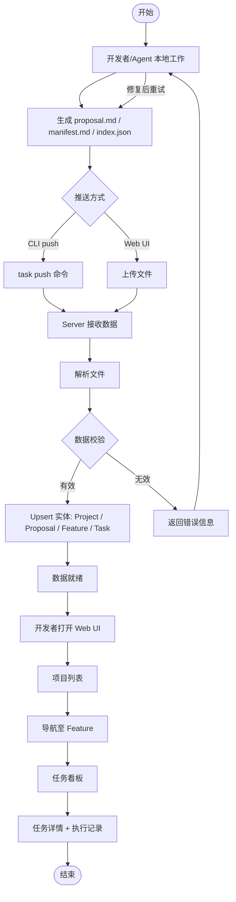
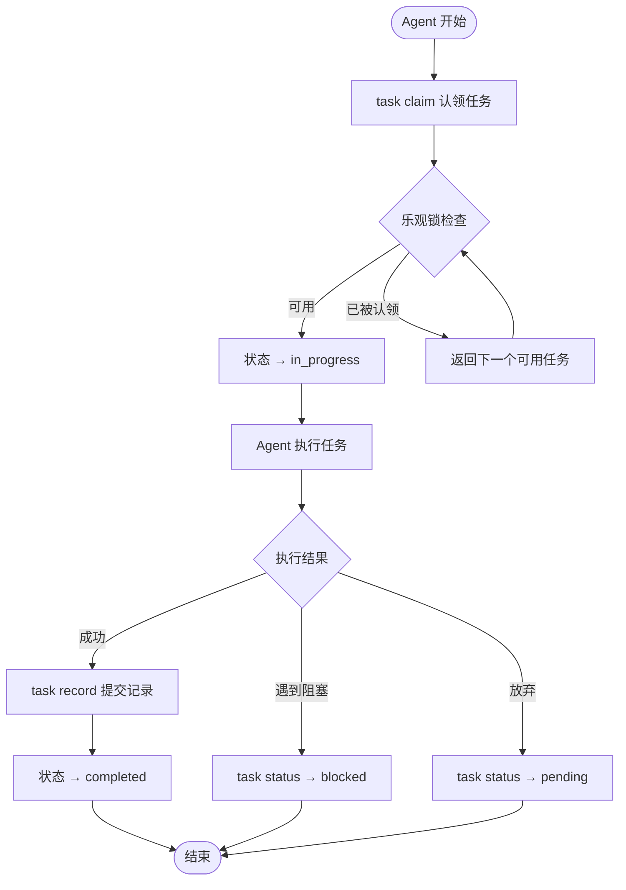
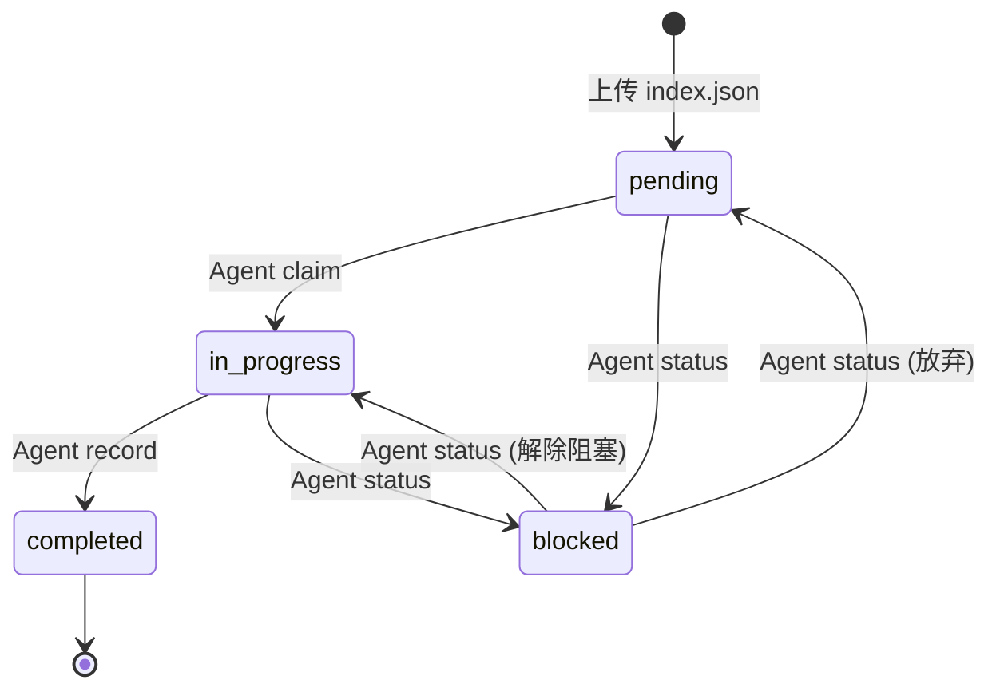

# Agent Task Center — PRD Spec

> PRD Spec: defines WHAT the feature is and why it exists.

## 需求背景

### 为什么做（原因）

zcode task-cli 是纯本地文件系统工具，任务数据（index.json）存在于单个项目目录中，存在四个核心问题：

1. **不可见** — 缺少任务依赖图和执行进度的可视化，开发者无法直观了解项目全局状态
2. **不集中** — 无法在一个地方查看多个项目的任务状态，需要频繁切换本地目录
3. **不共享** — 多个 Agent 各自操作本地文件，无法共享任务状态和执行历史
4. **不可追溯** — 缺少执行记录和 Agent 活动追踪，无法审计 Agent 的工作质量

### 要做什么（对象）

构建 Agent Task Center —— 一个集中化的任务可视化与协作服务：

- **Web UI**：只读看板 + 文件上传，开发者通过浏览器查看 Project → Proposal → Feature → Task 四层实体状态和进度
- **Server**：集中数据存储、文件解析（index.json / proposal.md / manifest.md）、提供 Web API 和 Agent API
- **CLI 集成**：通过 task-cli 将本地 docs/ 目录推送到 Server
- **Agent 远程操作**：Agent 通过 task-cli 远程模式认领任务、更新状态、提交执行记录

### 用户是谁（人员）

| 角色 | 说明 |
|------|------|
| 开发者 | 通过 Web UI 查看多项目进度，通过 CLI 推送本地数据到 Server |
| AI Agent | 通过 CLI 远程模式与 Server 交互，认领/执行/提交任务 |

## 需求目标

| 目标 | 量化指标 | 说明 |
|------|----------|------|
| 多项目可视 | ≥3 个项目同时展示 | 消除项目间切换，一览全局进度 |
| Agent 零学习成本 | 现有 task-cli 命令远程模式正常工作 | 通过环境变量切换本地/远程模式 |
| 看板实时性 | 数据变更后页面刷新即可见 | push/claim/record 操作后无需等待 |
| 并发安全 | ≥3 个 Agent 同时认领不同任务不冲突 | 乐观锁保证 |
| 执行可追溯 | 每条执行记录包含完整的摘要、文件、测试、决策数据 | 100% 覆盖 record.json 所有字段 |

## Scope

### In Scope
- [ ] 四层数据模型（Project → Proposal → Feature → Task）
- [ ] Web UI 只读看板（项目/提案/功能/任务四层导航）
- [ ] 任务看板（按状态分列：pending / in_progress / completed / blocked，支持按优先级、标签、状态筛选）
- [ ] 任务详情页 + 执行记录时间线
- [ ] Proposal / Feature 文档查看（Markdown 渲染）
- [ ] Web UI 文件上传（index.json、proposal.md 等文档）
- [ ] CLI 推送（task push 将 docs/ 目录推送到 Server）
- [ ] Agent 远程操作（claim / status / record / get-content）
- [ ] 数据 Upsert 语义（重复上传更新现有任务 + 新增任务）
- [ ] 并发认领安全（乐观锁）

### Out of Scope
- 认证 / 授权
- Web UI 表单创建 / 编辑实体
- AI 自动规划 / 任务拆解
- Feature 文件同步（push/pull 设计文档附件——指通用的双向文件附件管理，与 V1 的"Web UI 文件上传"不同：上传仅处理结构化文档的解析和 Upsert，不同步文件原文）
- 实时通知（WebSocket）
- CI/CD 集成
- MCP Server 模式
- 任务自动调度算法
- 任务依赖图（DAG 可视化）→ V2
- Agent 活动面板 → V2
- 看板拖拽排序 → V2

## 流程说明

### 业务流程说明

核心业务流程分为三条主线：

1. **数据推送流程**：开发者/Agent 通过 CLI 将本地 docs/ 推送到 Server，Server 解析文件并创建/更新实体
2. **Agent 执行流程**：Agent 认领任务 → 执行 → 提交记录，驱动任务状态流转
3. **数据查看流程**：开发者通过 Web UI 浏览四层实体，查看任务看板和执行记录

### 业务流程图

**数据推送与查看流程：**

**Agent 任务执行流程：**

**任务状态机：**

### 数据流说明

| 数据流编号 | 源系统 | 目标系统 | 数据内容 | 传输方式 | 频率 | 格式 | 备注 |
|-----------|--------|----------|----------|----------|------|------|------|
| DF001 | task-cli | Server | docs/ 目录（index.json, proposal.md, manifest.md 等） | REST API | 按需 | multipart/form-data | push 操作 |
| DF002 | Web UI | Server | index.json / markdown 文件 | REST API | 按需 | multipart/form-data | 文件上传 |
| DF003 | Server | Web UI | Project / Proposal / Feature / Task 聚合数据 | REST API | 页面请求 | JSON | 只读查询 |
| DF004 | task-cli (Agent) | Server | 认领请求（agent_id） | REST API | 按需 | JSON | 乐观锁 |
| DF005 | task-cli (Agent) | Server | 执行记录（record.json） | REST API | 任务完成时 | JSON | 含文件列表/测试/决策 |
| DF006 | Server | task-cli (Agent) | 任务详细内容 | REST API | 按需 | JSON | get-content |

## 功能描述

### 5.1 项目列表页

**数据来源**：Server 中所有 Project 实体及其聚合统计

**显示范围**：所有已创建的项目

**数据权限**：V1 无权限控制，所有用户可查看所有项目

**排序方式**：默认按更新时间倒序

**翻页设置**：每页 20 条，支持翻页

**页面类型**：仪表盘

**示例数据**：

| 项目名称 | Feature 数 | 任务总数 | 完成率 | 最近更新 |
|----------|-----------|---------|--------|---------|
| agent-task-center | 3 | 24 | 62.5% | 2026-04-12 14:30 |
| data-pipeline | 2 | 16 | 100% | 2026-04-11 09:15 |
| web-platform | 4 | 32 | 25% | 2026-04-10 18:00 |

**列表字段**：

| 字段名称 | 类型 | 说明 |
|---------|------|------|
| 项目名称 | string | 可点击，进入项目详情 |
| Feature 数 | number | 关联的 Feature 计数 |
| 任务总数 | number | 所有关联 Task 计数 |
| 完成率 | number | completed 任务 / 总任务 × 100% |
| 最近更新 | datetime | 最后一次数据变更时间 |

**搜索条件**：

| 序号 | 搜索项 | 控件类型 | 说明 | 默认提示 |
|------|--------|----------|------|----------|
| 1 | 项目名称 | 输入框 | 模糊匹配 | 搜索项目名称 |

### 5.2 项目详情页

进入项目后展示该项目的 Proposal 列表和 Feature 列表，以 Tab 切换。

**Proposal Tab 列表字段**：

| 字段名称 | 类型 | 说明 |
|---------|------|------|
| 提案标题 | string | 可点击，查看提案文档内容 |
| 创建时间 | datetime | 首次上传时间 |
| 关联 Feature 数 | number | 从该 Proposal 拆分的 Feature 数 |

**Feature Tab 列表字段**：

| 字段名称 | 类型 | 说明 |
|---------|------|------|
| Feature 名称 | string | 可点击，进入 Feature 看板 |
| 任务完成率 | number | completed / total × 100% |
| 状态 badge | string | prd / design / tasks / in-progress / done |
| 最近更新 | datetime | 最后变更时间 |

### 5.3 任务看板页（Feature 级别）

**数据来源**：选定 Feature 下所有 Task

**显示范围**：当前 Feature 的全部 Task

**页面类型**：列表页（Kanban 布局）

**布局**：四列看板 — pending | in_progress | completed | blocked，每个 Task 为一张卡片

**状态说明**：

| 状态值 | 显示文本 | 业务含义 |
|--------|----------|----------|
| pending | 待认领 | 任务等待 Agent 认领 |
| in_progress | 进行中 | Agent 已认领正在执行 |
| completed | 已完成 | Agent 已提交执行记录 |
| blocked | 已阻塞 | 任务无法继续执行 |

**任务卡片字段**：

| 字段名称 | 类型 | 说明 |
|---------|------|------|
| task_id | string | 任务编号（如 1.1） |
| 标题 | string | 任务标题 |
| 优先级 badge | string | P0(红) / P1(橙) / P2(蓝) |
| 认领者 | string | agent_id，未认领显示空 |
| 标签 | string[] | 任务标签 |

**加载策略**：单次请求加载当前 Feature 全部 Task（V1 单 Feature ≤ 500 任务），前端按状态分组渲染为四列。若后续单 Feature 任务数超过阈值，切换为按状态列分页请求。

**筛选条件**（序列化到 URL，支持分享）：

| 序号 | 筛选项 | 控件类型 | 说明 |
|------|--------|----------|------|
| 1 | 优先级 | 下拉多选 | P0 / P1 / P2 |
| 2 | 标签 | 下拉多选 | 从当前 Feature 的所有标签聚合 |
| 3 | 状态 | 下拉多选 | pending / in_progress / completed / blocked |

### 5.4 任务详情页

**页面类型**：详情页

**基本信息区域**：

| 字段名称 | 类型 | 说明 |
|---------|------|------|
| task_id | string | 任务编号 |
| 标题 | string | 任务标题 |
| 状态 | string | 当前状态 + badge 颜色 |
| 优先级 | string | P0/P1/P2 |
| 认领者 | string | agent_id |
| 标签 | string[] | 任务标签 |
| 依赖任务 | string[] | 所依赖的 task_id 列表，可点击跳转 |
| 描述 | markdown | 任务详细描述（Markdown 渲染） |

**执行记录时间线区域**：

按时间倒序展示执行记录，每页 10 条，支持"加载更多"懒加载。每条记录：

| 字段名称 | 类型 | 说明 |
|---------|------|------|
| 时间戳 | datetime | 提交时间 |
| agent_id | string | 执行 Agent |
| summary | string | 执行摘要 |
| 展开后 ↓ | | |
| filesCreated | string[] | 新建文件列表 |
| filesModified | string[] | 修改文件列表 |
| keyDecisions | string[] | 关键决策 |
| testsPassed | number | 通过测试数 |
| testsFailed | number | 失败测试数 |
| coverage | number | 覆盖率 |
| acceptanceCriteria | array | 验收标准及达成情况 |

### 5.5 文档查看页

**数据来源**：Server 存储的 proposal.md / manifest.md 等文档

**功能**：Markdown 渲染展示，支持标题锚点导航

**关联展示**：页面底部显示关联的 Feature / Task 列表

### 5.6 文件上传

**入口**：项目详情页右上角「上传」按钮

**权限控制**：V1 无权限限制

**支持格式**：

| 上传文件 | 解析行为 | Upsert 规则 |
|---------|---------|------------|
| index.json | 按 task_id 匹配现有 Task | 已有 → 更新（标题、描述、依赖等）；新增 → 创建；已有但不在新文件中 → 保留不变 |
| proposal.md | 按标题匹配现有 Proposal | 已有 → 更新内容；不存在 → 创建 |
| manifest.md | 按 Feature slug 匹配 | 已有 → 更新内容；不存在 → 创建 |

**校验规则**：

| 序号 | 校验条件 | 错误提示 | 提示方式及位置 |
|------|----------|----------|----------------|
| 1 | 文件格式不支持 | 仅支持 .json 和 .md 文件 | 上传区域下方 |
| 2 | JSON 解析失败 | index.json 格式无效 | 上传区域下方 |
| 3 | 必填字段缺失 | task_id 和 title 为必填字段 | 上传区域下方 |

**数据处理逻辑**：

| 序号 | 操作 | 提交后的数据处理详细描述 |
|------|------|------------------------|
| 1 | 上传 index.json | 解析 JSON → 按 task_id 匹配 → Upsert Task → 自动关联所属 Feature 和 Project → 返回解析摘要 |
| 2 | 上传 proposal.md | 存储文档内容 → 解析标题 → Upsert Proposal → 自动关联 Project → 返回结果 |
| 3 | 上传 manifest.md | 存储文档内容 → 解析 Feature slug → Upsert Feature → 自动关联 Project → 返回结果 |

**上传反馈**：显示解析结果摘要（新增 N 个任务、更新 M 个任务、新增 1 个 Proposal 等）

### 5.7 CLI 推送（task push）

非 UI 功能。CLI 命令将本地 `docs/` 目录整体推送到 Server：

- 扫描 `docs/proposals/` 下所有 proposal.md
- 扫描 `docs/features/` 下所有 manifest.md 和 index.json
- 将解析结果批量 Upsert 到 Server
- 等同于批量执行 5.6 的文件上传逻辑

### 5.8 Agent 远程操作

非 UI 功能。Agent 通过 task-cli 远程模式调用 Server API：

| 操作 | 说明 | 核心逻辑 |
|------|------|---------|
| task claim | 认领下一个可用任务 | 按 priority 排序取第一个 pending + 依赖已满足的任务，乐观锁标记 agent_id |
| task status | 更新任务状态 | 验证 agent_id 是当前认领者，更新状态 |
| task record | 提交执行记录 | 写入执行记录，同时更新任务状态 |
| task get-content | 获取任务详细内容 | 返回任务 Markdown 内容 |

## 其他说明

### 性能需求
- 响应时间：页面首屏加载 ≤ 2s，API 响应 ≤ 500ms
- 并发量：支持 ≥ 3 个 Agent 同时操作 + 1 个开发者查看
- 数据存储量：单项目 ≤ 500 个任务，总存储 ≤ 100 个项目
- 兼容性：现代浏览器（Chrome、Firefox、Safari、Edge 最新两个主版本）

### 数据需求
- 数据埋点：V1 不要求
- 数据初始化：首次 CLI push 时自动创建 Project 和关联实体
- 数据迁移：V1 无历史数据迁移需求

### 监控需求
- V1 无专门的监控要求，Server 日志记录 API 请求即可

### 安全性需求
- 传输加密：支持 HTTPS
- 认证/授权：V1 不实现，API 开放访问
- Agent ID 校验：记录 agent_id 但不做身份验证（信任模式）

---

## 质量检查

- [x] 需求标题是否概括准确
- [x] 需求背景是否包含原因、对象、人员三要素
- [x] 需求目标是否量化
- [x] 流程说明是否完整
- [x] 业务流程图是否包含（Mermaid 格式）
- [x] 列表页描述是否完整（数据来源/显示范围/权限/排序/翻页/字段/搜索）
- [x] 按钮描述是否完整（权限/状态/校验/数据逻辑）
- [x] 表单描述是否完整（字段/校验规则）
- [x] 关联性需求是否全面分析
- [x] 非功能性需求（性能/数据/监控/安全）是否考虑
- [x] 所有表格是否填写完整
- [x] 是否有歧义或模糊表述
- [x] 是否可执行、可验收
